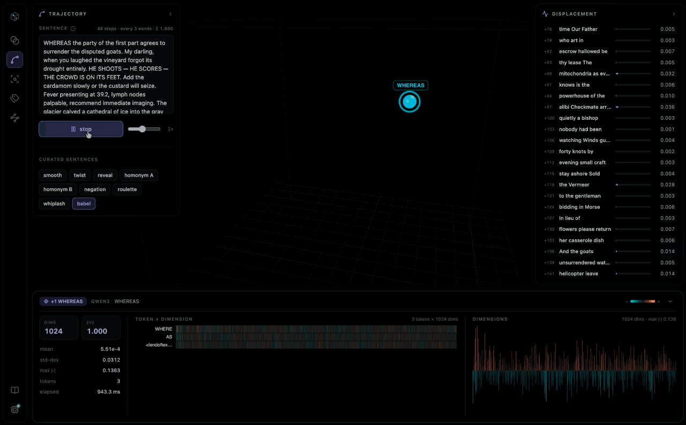

# Embedding Playground



An interactive 3D playground for understanding modern text-embedding models. Everything runs locally — WebGPU first, WebAssembly as a fallback, Ollama as an optional local-daemon backend. No server, no API keys, no telemetry.

**Try it:** https://neovand.github.io/EmbeddingPlayground/


## The idea

One full-bleed 3D cloud — a live PCA projection of embedding vectors — with everything else floating on top of it as glass panels. An icon rail on the left switches between six labs, a curriculum that reads top to bottom: *meaning → sequence → retrieval → decision → structure → mechanism*.

| Lab | Question it answers |
| --- | --- |
| **Compare** | What does cosine similarity *mean*? Two texts plus reference points so the visual scale carries information. |
| **Trajectory** | How does meaning build up across a sentence? Each prefix `word_1..k` is embedded independently, projected into one fixed PCA basis, and played back as a path — with a cinematic camera that follows each point as it appears, a speed control, and displacement bars that highlight the words that moved meaning most. |
| **Retrieve** | Which chunks of a document semantically match a query? Four chunking strategies, role-correct query/document prefixes, top-N ranking by cosine or euclidean, lexical-overlap highlighting as a tell. |
| **Classify** | Can you classify with no training? Nearest-prototype over class-mean embeddings, with a *visible* softmax temperature so the confidence is honest. |
| **Cluster** | What structure falls out with no labels? K-means (k-means++ on the unit hypersphere), silhouette score, and a Rand index against ground-truth topics. |
| **Anatomy** | What is the model *actually doing*? A custom MiniLM ONNX export (ships with the app, ~23 MB) exposes every internal tensor: walk the pipeline stage by stage — WordPiece ids, embedding + position strips, live attention arcs for all 72 heads with auto-computed roles (prev-token, [SEP] sink, broad…), mean-pool contributions, L2 normalization, and every token's 7-layer trajectory through latent space. |

Click any point and the **scope bar** along the bottom fills with its vitals; pull it up and the full inspector opens — a per-token × dimension heatmap and signed dimension bars that follow along during playback. In Anatomy, selecting a token repurposes the heatmap: its rows become that token's stops through the network (embedding, then after each block). Every lab ships a short **guide** (the book icon on the rail): a few steps that drive real state, not a static tour. A subtle **spin** toggle on the cloud slowly orbits the camera — everywhere.

### Inside the Anatomy lab

The left dock is the actual forward pass — tokenize → embed + position → six transformer blocks → mean pool → L2 normalize — and each stage renders live from your sentence. Attention is drawn vertically: tokens read downward, arcs bow into a gutter (per-head, or every head's strongest link at once), and each token carries a ‖Δh‖ bar showing how far that block moved it. The head grid badges all 12 heads per block from live statistics (Clark et al. 2019): previous-token heads, [CLS]/[SEP] attention sinks, broad bag-of-words heads. The final stage plots every token's 7-stop trail through latent space — load "two banks" and watch two identical `bank` tokens start at the same point and get pulled apart by context.

### Curated trajectory presets

Displacement dynamics turn out to be strongly *model-dependent*, so the Trajectory lab ships paragraphs benchmarked per model tier: **roulette** (genre-per-sentence, tuned on MiniLM), **whiplash** (register fragments, tuned on Nomic), and **babel** (a babel of registers — contract, sportscast, chart notes, liturgy, obituary — tuned on Qwen3). Same text, different model, different path: that's the lesson.

## Models

Twelve models in the registry, all running in the browser via `@huggingface/transformers` v4, managed from the model panel (the chip on the rail — download states, backend badges, live progress):

| Model | Params | Dims | Pooling | Notes |
| --- | --- | --- | --- | --- |
| all-MiniLM-L6-v2 | 22M | 384 | mean | the classic baseline |
| mdbr-leaf-ir | 23M | 768 | head | best <30M on MTEB v2, 23 MB download |
| mxbai-embed-xsmall-v1 | 24M | 384 | mean | instant-load tier |
| granite-embedding-small-english-r2 | 47M | 384 | mean | ModernBERT, 8k context |
| granite-embedding-97m-multilingual-r2 | 97M | 384 | cls | 200+ languages + code, 32k context |
| nomic-embed-text-v1.5 | 137M | 768 | mean | Matryoshka-trained, query/doc prefixes (default) |
| granite-embedding-english-r2 | 149M | 768 | mean | long-document retrieval |
| snowflake-arctic-embed-m-v2.0 | 305M | 768 | cls | multilingual, query prefix |
| embeddinggemma-300m | 300M | 768 | head | custom `sentence_embedding` loader (WASM) |
| voyage-4-nano | 340M | 2048 | mean | first open Voyage, Matryoshka to 256 |
| Qwen3-Embedding-0.6B | 596M | 1024 | last-token | strong MTEB, instruct-style queries |
| pplx-embed-v1-0.6b | 600M | 1024 | mean | Perplexity, prompt-free, WebGPU-only q4 |

WebGPU is the default device when available (transformers.js v4's runtime fixed quantized inference on WebGPU, so the ModernBERT models no longer force WASM — only EmbeddingGemma still does, pending re-validation of its quantized output). Models with instruction prefixes get them **per role** — queries embed with the query template, documents with the document template. Weights are cached by the browser; full embedding results are cached in memory and pooled vectors in localStorage.

## Run it locally

```bash
git clone https://github.com/NeoVand/EmbeddingPlayground
cd EmbeddingPlayground
npm install
npm run dev
```

Then open http://localhost:5173. The first model load takes a few seconds to a minute depending on connection.

## Build

```bash
npm run build       # static site → build/
npm run preview     # serve build/ locally
npm test            # vitest unit tests for math + cache
npm run check       # svelte-check + tsc
```

The `main` branch deploys to GitHub Pages on every push via `.github/workflows/deploy.yml`.

## Stack

- **Svelte 5** (runes) + **SvelteKit** with `adapter-static`
- **TypeScript** strict mode
- **@huggingface/transformers** v4 for in-browser inference (+ optional Ollama backend)
- **Three.js** for the 3D cloud (WebGL + CSS2DRenderer labels, incremental scene updates, animated projection transitions, camera follow)
- **@lucide/svelte** icons via a central registry
- **vitest** for unit tests

Every color in the app — DOM, Three.js materials, canvas scales, per-lab identity hues — derives from five OKLCH primitives in `src/lib/theme/palette.ts`. Change a primitive and the whole app re-colors, 3D scene included.

## Project layout

```
src/
├── lib/
│   ├── anatomy/           # Anatomy engine: instrumented-MiniLM loader, head stats, flow stage
│   ├── corpus/            # Seed sentences for Compare's context toggle
│   ├── labs/              # The six labs + shared embed orchestration
│   │   ├── CompareLab.svelte
│   │   ├── TrajectoryLab.svelte
│   │   ├── RAGLab.svelte        # the Retrieve lab
│   │   ├── ClassifyLab.svelte
│   │   ├── ClusterLab.svelte
│   │   ├── AnatomyLab.svelte
│   │   ├── embed.svelte.ts      # debounced, generation-guarded single/batch embeds
│   │   └── labState.svelte.ts   # per-lab localStorage persistence
│   ├── math/              # PCA, k-means, similarity, stats — all unit-tested
│   ├── models/            # Registry + orchestrator + transformers.js / Ollama embedders
│   ├── rag/               # Sample documents + chunking strategies
│   ├── shell/             # Rail, docks, scope bar, guide, model manager, busy pill
│   ├── stores/            # Shared shell store (model, caches, lab switcher)
│   ├── theme/             # OKLCH primitives → every color in the app
│   └── viz/               # SemanticCloud, TokenHeatmap, DimensionBars
└── routes/
    ├── +layout.svelte
    ├── +layout.ts         # ssr=false (everything is client-only)
    └── +page.svelte       # Rail + lab host + overlays
```

The Anatomy lab's model at `static/models/minilm-anatomy/` is `all-MiniLM-L6-v2` re-exported to ONNX with all 7 hidden states and all 6 post-softmax attention tensors as named graph outputs (weights int8, activations fp32 — the visualized attention is exact). `scripts/export_anatomy.py` reproduces it.

## Known limitations

- **Static-embedding models** (model2vec, static-retrieval-mrl) and **Qwen3 ≥ 4B** are not wired up — static models need an `offsets` input for `EmbeddingBag`, and the bigger Qwen3 variants ship browser-prohibitive unquantized ONNX. This is also why there is no Analogies lab: word arithmetic doesn't really work on sentence transformers, and we'd rather show it honestly on a static model when one lands.
- **Matryoshka truncation** is modeled in the registry (`matryoshkaDims`) but not yet surfaced as a UI slider.
- **Ollama** backend covers only the models with an Ollama config (MiniLM, Nomic) and returns pooled vectors only — the token heatmap degrades gracefully.

## License

MIT.
